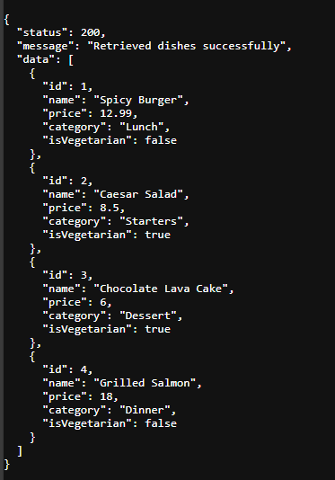

# RESTful API Activity - Myren Joy N. Lawig

## Best Practices Implementation

### 1. Environment Variables
**Why did we put `BASE_URI` in `.env` instead of hardcoding it?**  
Putting `BASE_URI` in the `.env` file allows us to change the API base path without modifying the source code. This makes the application easier to maintain, more flexible for different environments, and safer for deployment.

---

### 2. Resource Modeling
**Why did we use plural nouns (e.g., `/dishes`) for our routes?**  
Plural nouns represent a collection of resources. This follows RESTful API conventions and makes the API more consistent and easier to understand.

---

### 3. Status Codes
**When do we use `201 Created` vs `200 OK`?**  
`201 Created` is used when a new resource is successfully created, usually after a POST request.  
`200 OK` is used when a request is successful but does not create a new resource, such as GET, PUT, or DELETE requests.

**Why is it important to return `404` instead of just an empty array or a generic error?**  
Returning `404` clearly tells the client that the requested resource was not found. This helps with debugging and avoids confusion by providing accurate feedback about the request.

---

### 4. Testing
- (Paste a screenshot of a successful GET request here)

